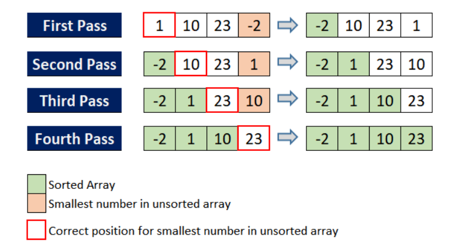
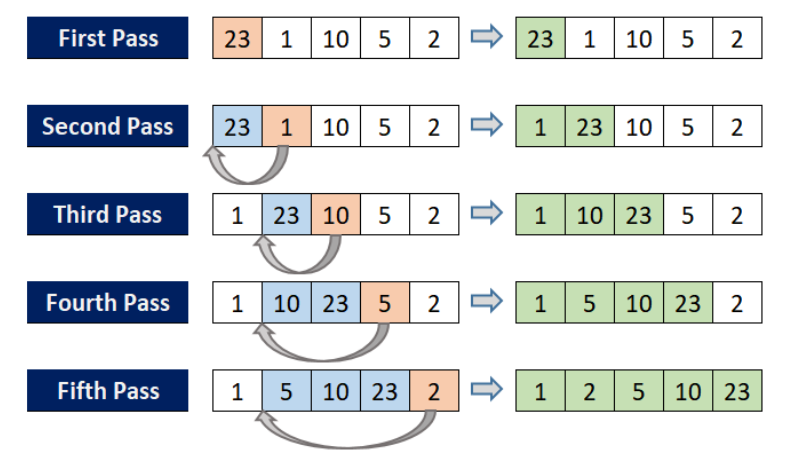
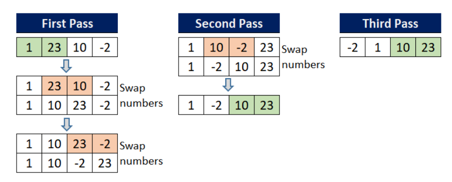
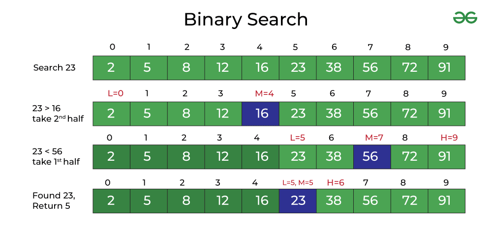

# Sort Algorithms

**Bài toán**: Sắp xếp một dãy số theo thứ tự tăng dần.

## Sắp xếp chọn (Selection Sort)

### Các bước



- **Bước 1**: Đối với phần tử đầu tiên, thực hiện vòng lặp sau:
  - So sánh từng phần tử (từ phần tử thứ hai đến phần tử cuối cùng) với phần tử đầu tiên.
  - Nếu phần tử đang so sánh nhỏ hơn phần tử đầu tiên, hoán đổi vị trí của chúng.
  - Sau khi kết thúc vòng lặp, phần tử nhỏ nhất sẽ được đặt ở vị trí đầu tiên trong danh sách.

- **Bước 2**: Đối với phần tử thứ hai, thực hiện vòng lặp tương tự:
  - So sánh từng phần tử (từ phần tử thứ ba đến phần tử cuối cùng) với phần tử thứ hai.
  - Nếu phần tử đang so sánh nhỏ hơn phần tử thứ hai, hoán đổi vị trí của chúng.
  - Sau khi kết thúc vòng lặp, phần tử nhỏ thứ hai sẽ được đặt ở vị trí thứ hai trong danh sách.

- **Bước 3**: Lặp lại quá trình tương tự cho phần tử thứ ba, thứ tư, ... cho đến phần tử kế cuối.

- **Bước 4**: Cuối cùng, dãy số được sắp xếp theo thứ tự tăng dần.

### Code

```python
def selection_sort(arr):
    n = len(arr)
    # Duyệt qua từng vị trí trong mảng
    for i in range(n):
        min_idx = i  # Giả sử phần tử nhỏ nhất nằm ở vị trí i

        # Tìm phần tử nhỏ nhất trong đoạn chưa sắp xếp
        for j in range(i + 1, len(arr)):
            if arr[j] < arr[min_idx]:  # Tìm thấy nhỏ hơn
                min_idx = j  # Cập nhật vị trí phần tử nhỏ nhất mới

        # Đổi chỗ phần tử nhỏ nhất với phần tử ở vị trí i
        arr[i], arr[min_idx] = arr[min_idx], arr[i]

    return arr
```

## Sắp xếp chèn (Insertion sort)

### Các bước



- **Bước 1**: Kiểm tra xem phần tử đầu tiên đã được sắp xếp chưa. Nếu rồi, chuyển sang bước tiếp theo.

- **Bước 2**: Lấy phần tử kế tiếp.

- **Bước 3**: So sánh phần tử này với tất cả các phần tử trong dãy con đã được sắp xếp.

- **Bước 4**: Dịch chuyển tất cả các phần tử trong dãy con đã sắp xếp mà lớn hơn giá trị cần sắp xếp sang bên phải.

- **Bước 5**: Chèn giá trị cần sắp xếp vào vị trí thích hợp.

- **Bước 6**: Lặp lại các bước trên cho đến khi toàn bộ danh sách được sắp xếp.

### Code

```python
def insertion_sort(arr):
    # Duyệt từ phần tử thứ 2 vì phần tử đầu tiên mặc định đã "được sắp xếp"
    for i in range(1, len(arr)):
        key = arr[i]        # Phần tử đang cần chèn vào phần đã sắp xếp
        j = i - 1           # Chỉ số cuối cùng của phần đã sắp xếp

        # Dịch các phần tử lớn hơn key sang phải
        while j >= 0 and arr[j] > key:
            arr[j + 1] = arr[j]
            j -= 1

        # Chèn key vào vị trí đúng
        arr[j + 1] = key

    return arr
```

## Sắp xếp nổi bọt (Bubble Sort)

### Các bước



- **Bước 1**: Đối với phần tử đầu tiên, thực hiện vòng lặp sau:
  - So sánh từng cặp phần tử kề nhau theo thứ tự từ cuối dãy đến phần tử đầu tiên.
  - Nếu phần tử phía sau nhỏ hơn phần tử phía trước, thì hoán đổi vị trí của chúng.
  - Sau khi kết thúc vòng lặp, phần tử nhỏ nhất sẽ được di chuyển đến vị trí đầu tiên của dãy.

- **Bước 2**: Đối với phần tử thứ hai, thực hiện vòng lặp tương tự:
  - So sánh từng cặp phần tử kề nhau theo thứ tự từ cuối dãy đến phần tử thứ hai.
  - Nếu phần tử phía sau nhỏ hơn phần tử phía trước, hoán đổi vị trí của chúng.
  - Sau khi kết thúc vòng lặp, phần tử nhỏ thứ hai sẽ được di chuyển đến vị trí thứ hai của dãy.

- **Bước 3**: Lặp lại quá trình tương tự cho phần tử thứ ba, thứ tư,... cho đến phần tử cuối cùng.

- **Bước 4**: Cuối cùng, dãy số sẽ được sắp xếp theo thứ tự tăng dần.

### Code

```python
def bubble_sort(arr):
    n = len(arr)
    for i in range(n):
        swapped = False                      # Cờ kiểm tra hoán đổi

        for j in range(n-1-i):               # So sánh các cặp 2 phần tử liền kề
            if arr[j] > arr[j+1]:            # Nếu sai thứ tự
                arr[j], arr[j+1] = arr[j+1], arr[j] # Đổi chỗ
                swapped = True               # Đã hoán đổi

        if not swapped:                      # Nếu không hoán đổi → dãy số đã sắp xếp
            break
    return arr
```

# Search Algorithms

**Định nghĩa**: Là một thuật toán tìm kiếm hiệu quả, được sử dụng để tìm một giá trị mục tiêu trong một mảng đã được sắp xếp (có thể theo thứ tự tăng dần hoặc giảm dần).

### Các bước



- **Bước 1**: So sánh phần tử ở giữa với giá trị mục tiêu.

- **Bước 2**: Nếu bằng nhau, trả về vị trí (tìm thấy mục tiêu).

- **Bước 3**: Nếu mục tiêu lớn hơn (trong mảng sắp xếp tăng dần), tiếp tục tìm kiếm ở nửa bên phải.

- **Bước 4**: Nếu nhỏ hơn, tìm kiếm ở nửa bên trái.

- **Bước 5**: Lặp lại cho đến khi tìm thấy giá trị hoặc phạm vi tìm kiếm trống.

### Code

```python
def binary_search(arr, target):
    left, right = 0, len(arr) - 1  # Khởi tạo 2 biên trái và phải

    while left <= right:
        mid = (left + right) // 2  # Tính vị trí phần tử ở giữa

        if arr[mid] == target:
            return mid             # Tìm thấy → trả về chỉ số
        elif arr[mid] < target:
            left = mid + 1         # Target nằm bên phải
        else:
            right = mid - 1        # Target nằm bên trái

    return -1                      # Không tìm thấy
```

# Độ phức tạp thời gian (Time Complexity)

**Độ phức tạp thời gian (Time Complexity)** là cách đánh giá mức độ tốn thời gian của một thuật toán khi kích thước dữ liệu đầu vào tăng lên, thay vì đo thời gian chạy cụ thể bằng giây ⏱️.
Nói ngắn gọn:

> 👉 Input càng lớn thì thuật toán chạy chậm lên như thế nào?

## Vì sao không đo bằng “giây”?

Vì thời gian chạy thực tế phụ thuộc vào:

- Máy mạnh hay yếu
- Ngôn ngữ lập trình
- Trình biên dịch

➡️ Time Complexity bỏ qua yếu tố phần cứng, chỉ quan tâm đến số bước thực hiện.

## Ký hiệu Big-O (O-notation)

Time Complexity thường được biểu diễn bằng Big-O:

| Ký hiệu        | Ý nghĩa           |
| -------------- | ----------------- |
| **O(1)**       | Thời gian hằng số |
| **O(n)**       | Tuyến tính        |
| **O(n²)**      | Bậc hai           |
| **O(log n)**   | Logarit           |
| **O(n log n)** | Tuyến tính – log  |

Dưới đây là bảng so sánh các độ phức tạp thường gặp nhất:

| Ký hiệu        | Tên gọi                | Ví dụ thực tế     |
| -------------- | -----------------      | ----------------- |
| **O(1)**       | Thời gian hằng số      | Truy cập một phần tử trong mảng bằng chỉ số (Index).
| **O(log n)**   | Thời gian Logarit      | Tìm kiếm nhị phân (Binary Search).
| **O(n)**       | Thời gian tuyến tính   | Duyệt qua tất cả các phần tử trong một danh sách.
| **O(n log n)** | Thời gian Linearithmic | Các thuật toán sắp xếp tối ưu như Merge Sort hay Quick Sort.
| **O(n²)**      | Thời gian bậc hai      | Hai vòng lặp lồng nhau (ví dụ: Sắp xếp nổi bọt - Bubble Sort).
| **O($2^n$)**   | Thời gian mũ           | Các bài toán đệ quy chưa tối ưu (như tính số Fibonacci cơ bản).

## Ví dụ trực quan trong Python

🔹 O(1) – Hằng số

```python
# Dù mảng có 10 hay 1 triệu phần tử → 1 bước
x = arr[0]
```

🔹 O(n) – Tuyến tính

```python
# n phần tử → n bước
for x in arr:
    print(x)
```

🔹 O(n²) – Bậc hai

```python
'''
n × n = n² bước
Rất chậm khi n lớn
'''
for i in range(n):
    for j in range(n):
        print(i, j)
```

🔹 O(log n) – Logarit (Binary Search)

```python
'''
Mỗi bước Binary Search chia đôi kích thước:
- Bước 1: n phần tử
- Bước 2: n/2 phần tử
- Bước 3: n/4 phần tử
- ...
- Bước k: n/(2^k) phần tử

Thuật toán dừng khi n/(2^k) = 1
→ n = 2^k
→ k = log₂(n)

Vậy số bước tối đa = log₂(n) → O(log n)

Kết luận: thời gian (Time Complexity) của Binary Search
  - Trường hợp tốt nhất: O(1)  → Tìm thấy ngay ở giữa
  - Trường hợp xấu nhất: O(log n)  → Tìm đến cùng
  - Trường hợp trung bình: O(log n)
'''
```